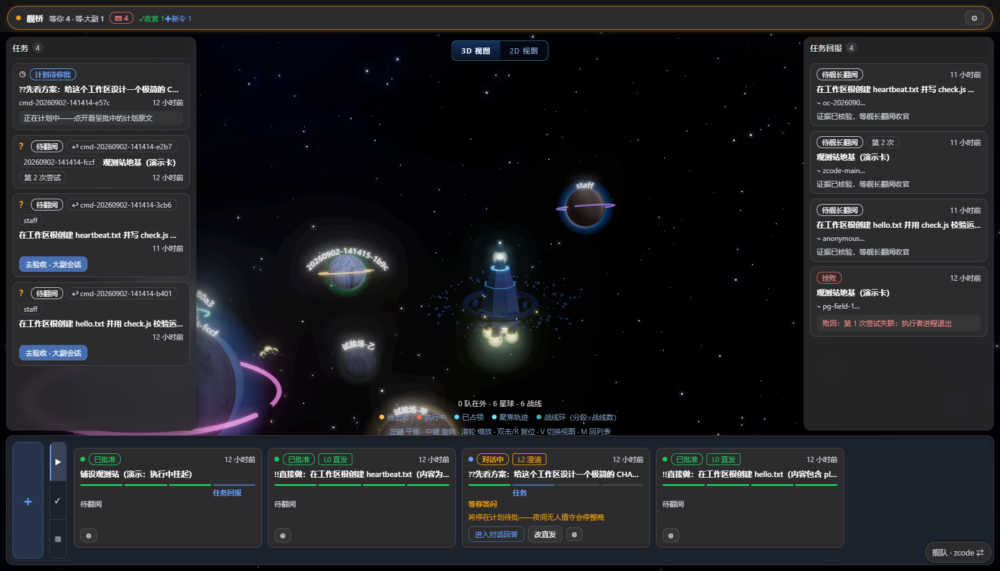
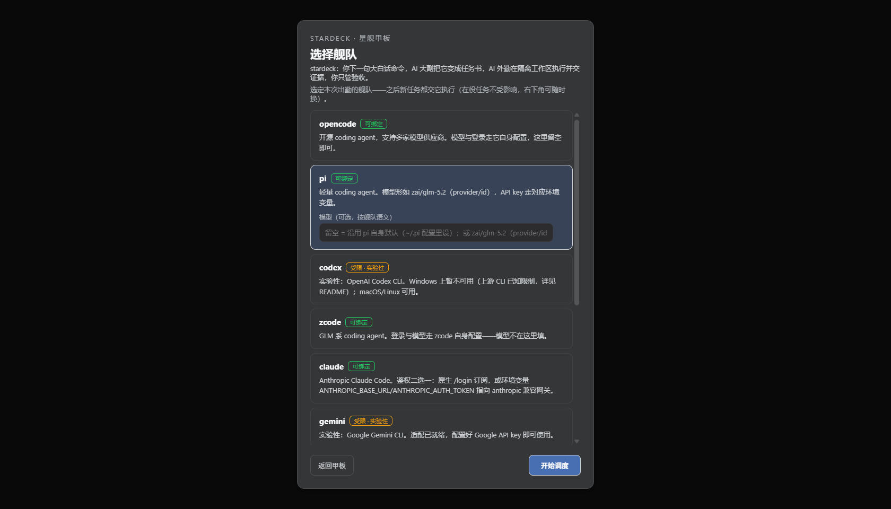
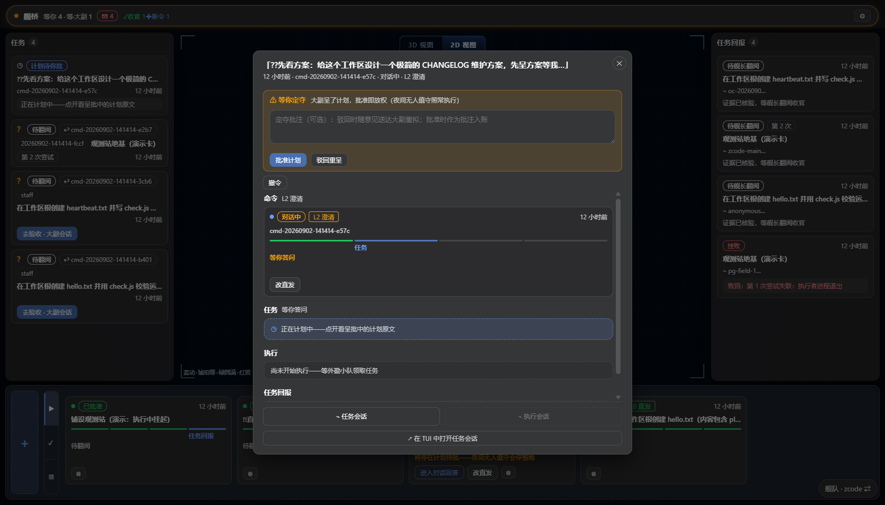
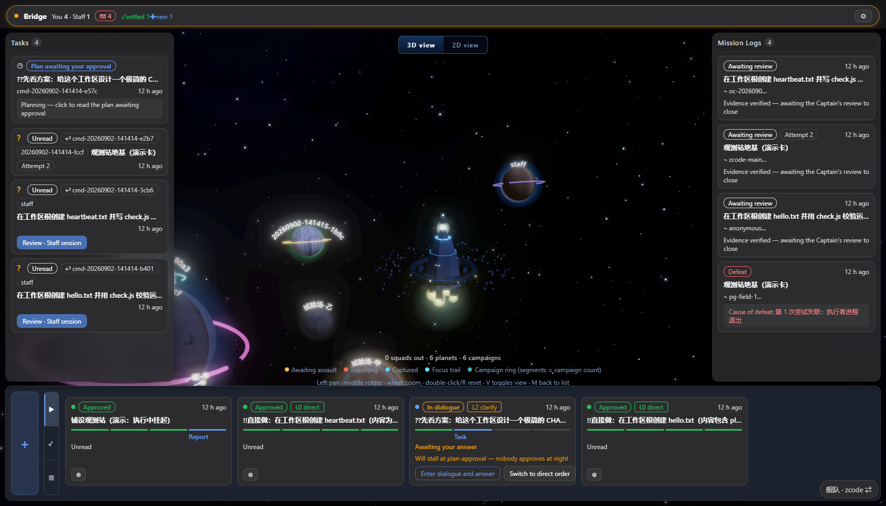
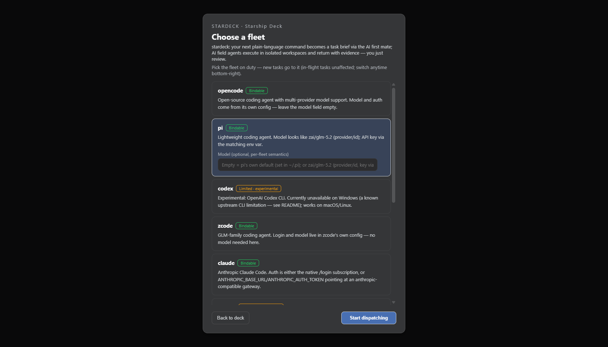
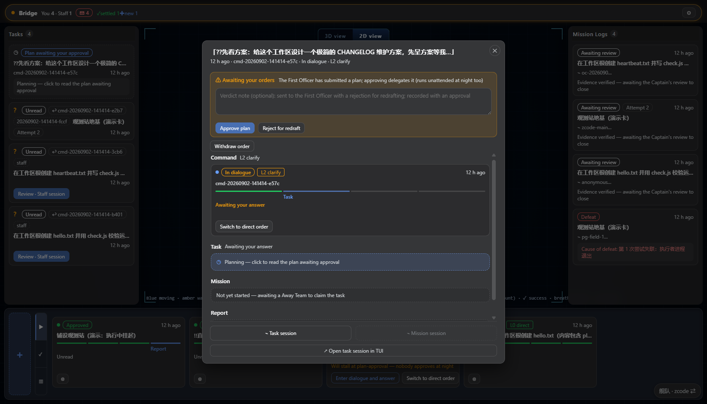

<div align="center">

# ⭐ stardeck · 星舰甲板

**agent 舰队的作战看板与守护进程。**

你下一句大白话命令，AI 大副把它变成任务书，AI 外勤在隔离工作区执行并交证据，你只管验收。
deck 一词双关：星舰飞行甲板（agent 在这里起降调度）+ deck of cards（一副任务卡——看板）。

[English](#english) · [中文](#中文) · [License](#license-mit)

</div>

---

<div align="center">

</div>

# 中文

## 这是什么

stardeck 是一个**本地优先**的多 agent 编排器：它不替 agent 干活，而是管住「下令 → 成案 → 执行 → 交证 → 验收」的完整环流。任意 CLI coding agent（opencode / pi / zcode / Claude Code / …）经注入的 MCP 桥或扩展领令出勤；**账本、令牌、证据核验由系统机械核对，不靠 agent 自报**。

- **3D 星域看板**：每条战线是一颗行星，执行进度实时投射在星域上（WebGL，2D 雷达视图可切，列表视图兜底）。
- **会话外归系统，会话内归 agent**：工作区物化、征召、巡检、验收定夺归 stardeck；读写文件、跑命令由 agent 自带工具完成——边界清晰，互不越权。
- **出口协议不可裁剪**：`war_claim` 令牌制领取、`war_submit` 证据核验（checks 全过 + 测试退出码 0 + 无越界文件，即 KillCredit）、`war_close_task` 人工验收收官。

## 核心特性

**🌊 3D 星域（默认视图）**
每条战线是一颗行星：执行中=推进行星轨迹，已收官=占领态，战线环分段=任务数。暗色模式一键切换，悬停高亮关联卡族，滚轮缩放、中键旋转。

**🪐 三列作战看板**
任务列（执行动向）· 任务回报列（证据与收官）· 底部调度坞（命令卡生命周期）。板是读投影：你在板上定夺（批计划/验收/撤令），agent 在工作区里干活。

**🎯 聚焦页：一条命令的一生**
点任意命令卡展开全生命周期：命令原文 → 大副计划（待批可带意见驳回）→ 执行会话 → 任务回报与证据，全程可溯源。

**🤖 大副 + 外勤双层编制**
AI 大副分诊你的命令（L0 直发 / L1 计划后做 / L2 先澄清），起草任务书呈你批准；批准后自动物化隔离工作区并征召外勤执行。**舰队绑定跟随你选的 CLI——大副和外勤都跑在你选的 agent 上**；只有双席都接通的 CLI 才会出现在绑定门里（当前六席）。

**🔒 证据核验（KillCredit）**
外勤交证不是打个「完成」：checks 逐项过、测试真实跑、无越界文件改动——机械判据全绿才算交付，最后由你翻阅收官。

**💬 板内答复与中途投递**
大副追问时在**聚焦页的答复框**直接作答（不走大副的原生会话窗口），答复自动送进大副会话续跑、不丢上下文；批注可转达进行中的外勤。答复通道按大副席别分流：pi（RPC 帧）与 opencode（`run -s` 续跑）已实弹接通，其余席暂以诚实文案拒答（契约在档逐席接入）。

**🌐 中英双语 + 三皮肤**
设置抽屉一键切换 中文/English，全板措辞实时换库（词典完备性由测试锁死，不静默回落）；军事/平话/星际迷航三套措辞皮肤。

## 界面

<div align="center">

<p><sub>舰队选择门：按你安装的 CLI 自动探测可用席位；模型输入随所选席位卡内展开（zcode 的模型在它自己那里配，卡内给出说明）</sub></p>
</div>

<div align="center">

<p><sub>聚焦页：计划待批——批准/驳回，驳回时意见随单送达大副重拟；底部可跳大副/执行会话回看全程（零 token 读本地会话存档）</sub></p>
</div>

## 快速开始

前置：[Node.js](https://nodejs.org) ≥ 22、[pnpm](https://pnpm.io) ≥ 9，以及至少一个受支持的 coding CLI（如 [opencode](https://opencode.ai)）。

```bash
git clone https://github.com/Kaiji-Z/stardeck.git
cd stardeck
pnpm install && pnpm build
node bin/stardeck.mjs          # 起守护进程 + 打开浏览器
```

浏览器会先经过**舰队选择门**——选一个已安装的 CLI（模型留空即沿用其自身默认），点「开始调度」，然后在左下角输入你的第一条命令，例如：

```
!!直接做：在工作区根创建 hello.txt，内容为当前时刻
??先看方案：给这个项目做一次依赖体检，先呈方案等我批准
```

`!!` 强制直发（跳过计划审批），`??` 强制先看方案。默认档位由大副自动分诊。

### 常用命令

```bash
node bin/stardeck.mjs open     # 起守护进程并拉起浏览器
node bin/stardeck.mjs status   # 探活：舰队/revision/账面计数
node bin/stardeck.mjs stop     # 优雅停服（在役执行者先行收割）
pnpm test                      # 全量测试
pnpm verify                    # 三段式验收门：tests + build + 针脚
pnpm live                      # 端到端实机门：真 CLI 外勤全链（需已配好 opencode）
```

### 配置

配置文件 `~/.stardeck/config.json`（或 `STARDECK_CONFIG` 指路），环境变量均可覆盖：

| 变量 | 作用 | 默认 |
|---|---|---|
| `STARDECK_PORT` | 看板端口 | `3970` |
| `STARDECK_STATE_DIR` | 账本/日志目录 | `~/.stardeck` |
| `STARDECK_WAR_ROOT` | 任务工作区根 | `<state>/tasks` |
| `STARDECK_EXECUTOR` | 预设舰队 | `opencode` |
| `STARDECK_MODEL` | 预设模型 | 空（各 CLI 自身默认） |
| `STARDECK_STAFF` | AI 大副自动分诊 | 开 |

舰队绑定写在配置文件里，重启保持；板面随时可换绑（在役任务不受影响）。

## 支持的舰队

**双席正典**：一个舰队能被选中，必须**大副 + 外勤两个岗位都接通**——大副分诊呈批、外勤干活交证，都跑在你选的 CLI 上。

| 状态 | CLI | 说明 |
|---|---|---|
| ✅ 稳定 | [opencode](https://opencode.ai) | 开源、多供应商；项目级 `opencode.json` 注入 MCP 桥 |
| ✅ 稳定 | [pi](https://github.com/badlogic/pi-mono) | 轻量；扩展件注册出口协议工具 |
| ✅ 稳定 | zcode | GLM 系；模型走其自身配置 |
| ✅ 稳定 | [Claude Code](https://docs.anthropic.com/en/docs/claude-code) | 原生订阅或 anthropic 兼容网关 |
| ✅ 稳定 | [Codex CLI](https://github.com/openai/codex) | 经 Responses→chat 垫片直驱 GLM（`stardeck codex-shim`，另配 `STARDECK_CODEX_SHIM_BASE`）；工具走 HTTP 直连 |
| ✅ 稳定 | dsh（DeepSeek Harness） | 走源码仓克隆入口；网关 env `DEEPSEEK_API_KEY/BASE_URL`（自动映射 Z_AI_*） |
| 🚧 暂不可绑 | Gemini CLI | 双席未接通（外勤契约在档未实弹、大副通道未建）——配好 key 实弹转正后开放 |
| 🚧 暂不可绑 | Qwen Code | 双席未接通（外勤半证、大副通道未建）——实弹转正后开放 |
| 🚧 即将支持 | Copilot CLI / Amp / Cursor CLI / Droid | 适配进行中（部分走 ACP 协议） |

## 架构速览

```
bin/stardeck.mjs ─→ dist/cli.mjs ─→ src/daemon.ts（守护进程装配）
                                      ├─ dashboard.ts（/warroom/api/* 板投影 + SSE）
                                      ├─ tools.ts（24 个 war_* 工具；MCP 桥暴露给 agent）
                                      ├─ executor.ts（执行者适配器：无头框定 + 会话捕获 + 跳转）
                                      ├─ staff.ts（AI 大副：分诊/计划/发布工单）
                                      ├─ steer.ts（RPC 续跑：板内答复/批注转达送进在途会话）
                                      ├─ 巡检 15s（失联回收 + 补征召）+ staffTick（到点派发）
                                      └─ 板 UI（React + WebGL 星域；中英双语）
src/ 其余 = 账本内核：append-only JSONL + fold（永不过写，只派生状态）
```

设计要点：

- **append-only 账本**：命令/任务/事件一律追加 JSONL，状态由纯函数 fold 派生——崩溃安全、可追溯、可重放。
- **attemptId 即令牌**：外勤凭征召令牌领取任务并交证，无令牌的提交一律拒绝。
- **进程即生命**：执行者进程失联由巡检回收（记败+重派），daemon 重启不残留僵尸会话。

## 安全模型

stardeck 的威胁模型是**本机互信**：

- daemon 只监听 `127.0.0.1`，**没有鉴权**——不要把端口转发到公网，不要在多用户机器上裸跑。
- 外勤在**隔离任务工作区**内工作，越界文件改动会被证据核验判负；任务书与验收标准就是围栏。
- 会话历史读档（板内弹窗）直接读本机各 CLI 落盘的会话库——零 token，共享屏幕演示时留意全文可见。

## 文档

- [AGENTS.md](AGENTS.md) — 迭代指引（新会话先读）
- [DESIGN.md](DESIGN.md) — 决策录
- [CHANGELOG.md](CHANGELOG.md) — 版本记录
- [VERIFICATION.md](VERIFICATION.md) — 验证体系
- [eval/](eval) — 监督评测（promptfoo 三维门）

## 贡献

欢迎 issue 与 PR。提交前请跑 `pnpm verify`（tests + build + 针脚三段式）与 `pnpm live`（端到端实机门）。改提示词资产必须过快照门（`WARROOM_UPDATE_SNAPSHOTS=1` 重新生成 fixtures 并随改动一并提交）。

---

<div align="center">

</div>

# English

## What is this

stardeck is a **local-first** multi-agent orchestrator: it doesn't do the agents' work — it owns the full loop of *order → brief → execute → evidence → acceptance*. Any CLI coding agent (opencode / pi / zcode / Claude Code / …) takes orders through an injected MCP bridge or extension; **ledgers, tokens and evidence are verified mechanically by the system, never taken on the agent's word**.

- **3D starfield board**: every campaign is a planet; execution progresses in real time on the starfield (WebGL, 2D radar view, list view fallback).
- **Outside the session belongs to the system; inside belongs to the agent**: workspace materialization, conscription, patrol and acceptance belong to stardeck; file edits and commands run with the agent's own tools — clean boundaries, no overreach.
- **The exit protocol is not negotiable**: `war_claim` token-based claiming, `war_submit` evidence verification (all checks pass + tests exit 0 + no out-of-bounds files — the KillCredit), `war_close_task` human acceptance.

## Highlights

**🌊 3D starfield (default view)**
Every campaign is a planet: executing campaigns advance along their orbits, finished ones turn captured, campaign rings segment per task. One-click dark mode, hover to highlight related card families, wheel zoom, middle-drag rotate.

**🪐 Three-column operations board**
Tasks column (execution status) · Mission logs column (evidence & closure) · bottom dispatch dock (command lifecycle). The board is a read projection: you decide on it (approve plans / accept / withdraw orders), agents work in workspaces.

**🎯 Focus page: one command's whole life**
Click any command card for its full lifecycle: original order → staff plan (reject with a note while pending) → execution sessions → mission report & evidence, all traceable.

**🤖 Two-tier crew: first mate + field agents**
An AI first mate triages your orders (L0 direct / L1 plan-first / L2 clarify-first), drafts task briefs for your approval; approved orders get an isolated workspace and a field agent conscripted. **The fleet binding follows your chosen CLI** — both the first mate and field agents run on the agent you pick; only CLIs with both roles wired appear in the binding gate (six today).

**🔒 Evidence verification (KillCredit)**
"Done" is not a claim: every check passes, tests really run, no out-of-bounds file changes — all mechanical criteria green before it counts as delivered, and you give the final review.

**💬 In-board answers & mid-flight delivery**
When the first mate asks a clarifying question, answer right in the **focus-page answer box** (no need to open the mate's native session) — the reply is delivered into the mate's session and it resumes with full context; comments can be relayed to in-flight agents. The answer channel is per-seat: pi (RPC frames) and opencode (run -s resume) are live-wired; other seats reject honestly until their contracts land.

**🌐 Bilingual UI + three skins**
Switch 中文/English in the settings drawer — the whole board re-renders live (dictionary completeness is test-enforced, no silent fallback); Military / Plain / Star Trek wording skins.

## Screenshots

<div align="center">

<p><sub>Fleet gate: seats probed from your installed CLIs; the model input expands inside the selected seat card (zcode's model lives in its own config — the card explains it)</sub></p>
</div>

<div align="center">

<p><sub>Focus page: plan pending — approve or reject (a note rides along for the redraft); jump to staff/mission session history at the bottom (zero-token reads of local session archives)</sub></p>
</div>

## Quick start

Prerequisites: [Node.js](https://nodejs.org) ≥ 22, [pnpm](https://pnpm.io) ≥ 9, and at least one supported coding CLI (e.g. [opencode](https://opencode.ai)).

```bash
git clone https://github.com/Kaiji-Z/stardeck.git
cd stardeck
pnpm install && pnpm build
node bin/stardeck.mjs          # start the daemon + open the browser
```

The browser first shows the **fleet gate** — pick an installed CLI (leave the model empty to use its own default), hit *Start dispatching*, then type your first order in the bottom-left composer:

```
!!direct: create hello.txt in the workspace root with the current time
??plan-first: run a dependency health check on this project, show me the plan first
```

`!!` forces direct execution (skips plan approval), `??` forces plan-first. Default tiers are triaged by the AI first mate.

### Commands

```bash
node bin/stardeck.mjs open     # start the daemon and open the browser
node bin/stardeck.mjs status   # liveness: fleet / revision / ledger counts
node bin/stardeck.mjs stop     # graceful shutdown (in-flight agents harvested first)
pnpm test                      # full test suite
pnpm verify                    # three-stage gate: tests + build + needles
pnpm live                      # end-to-end live gate: a real CLI agent full loop (needs opencode set up)
```

### Configuration

Config file at `~/.stardeck/config.json` (or point `STARDECK_CONFIG` elsewhere); every key has an env override:

| Variable | Purpose | Default |
|---|---|---|
| `STARDECK_PORT` | board port | `3970` |
| `STARDECK_STATE_DIR` | ledger/log directory | `~/.stardeck` |
| `STARDECK_WAR_ROOT` | task workspace root | `<state>/tasks` |
| `STARDECK_EXECUTOR` | default fleet | `opencode` |
| `STARDECK_MODEL` | default model | empty (each CLI's own default) |
| `STARDECK_STAFF` | AI first mate triage | on |

Fleet binding is persisted to the config file and survives restarts; rebind anytime from the board (in-flight tasks unaffected).

## Supported fleets

**Dual-role canon**: a fleet is selectable only when **both roles are wired** — the first mate (triage & briefing) and the field agents (work & evidence) all run on the CLI you pick.

| Status | CLI | Notes |
|---|---|---|
| ✅ Stable | [opencode](https://opencode.ai) | Open-source, multi-provider; MCP bridge injected via project `opencode.json` |
| ✅ Stable | [pi](https://github.com/badlogic/pi-mono) | Lightweight; an extension registers the exit-protocol tools |
| ✅ Stable | zcode | GLM family; model lives in its own config |
| ✅ Stable | [Claude Code](https://docs.anthropic.com/en/docs/claude-code) | Native subscription or an anthropic-compatible gateway |
| ✅ Stable | [Codex CLI](https://github.com/openai/codex) | GLM via the Responses→chat shim (`stardeck codex-shim` + `STARDECK_CODEX_SHIM_BASE`); tools over direct HTTP |
| ✅ Stable | dsh (DeepSeek Harness) | Runs from a source-tree clone; gateway env `DEEPSEEK_API_KEY/BASE_URL` (auto-maps Z_AI_*) |
| 🚧 Not bindable yet | Gemini CLI | Dual-role incomplete (executor contract never live-fired, no staff channel) — opens after a key + live-fire |
| 🚧 Not bindable yet | Qwen Code | Dual-role incomplete (executor half-proven, no staff channel) — opens after live-fire |
| 🚧 Coming soon | Copilot CLI / Amp / Cursor CLI / Droid | Adapters in progress (some via ACP) |

## Architecture

```
bin/stardeck.mjs ─→ dist/cli.mjs ─→ src/daemon.ts (daemon assembly)
                                      ├─ dashboard.ts (/warroom/api/* board projection + SSE)
                                      ├─ tools.ts (24 war_* tools; exposed to agents via MCP bridge)
                                      ├─ executor.ts (executor adapters: headless framing + session capture + jump)
                                      ├─ staff.ts (AI first mate: triage / plan / publish worklist)
                                      ├─ steer.ts (RPC resume: in-board answers & relays into live sessions)
                                      ├─ patrol 15s (lost-agent recovery + re-conscription) + staffTick (scheduled dispatch)
                                      └─ board UI (React + WebGL starfield; bilingual)
src/ rest = ledger kernel: append-only JSONL + fold (never overwrite; state is derived)
```

Design notes:

- **Append-only ledger**: commands/tasks/events are JSONL appends; state is derived by pure folds — crash-safe, traceable, replayable.
- **attemptId is the token**: field agents claim and submit with conscription tokens; tokenless submissions are rejected.
- **Process is life**: lost executor processes are recovered by the patrol (recorded as failed + re-dispatched); a daemon restart leaves no zombie sessions.

## Security model

stardeck's threat model is **local mutual trust**:

- The daemon listens on `127.0.0.1` only and has **no authentication** — never forward the port, never run bare on multi-user machines.
- Field agents work inside an **isolated task workspace**; out-of-bounds file changes fail evidence verification. The task brief and acceptance criteria are the fence.
- Session-history modals read the local session archives of your CLIs directly — zero tokens, but full text is visible on the board; mind screen sharing.

## Docs

- [AGENTS.md](AGENTS.md) — iteration guide (read first in a new session)
- [DESIGN.md](DESIGN.md) — decision records
- [CHANGELOG.md](CHANGELOG.md) — changelog
- [VERIFICATION.md](VERIFICATION.md) — verification system
- [eval/](eval) — supervised evaluation (promptfoo three-dimension gate)

## Contributing

Issues and PRs welcome. Run `pnpm verify` (tests + build + needles) and `pnpm live` (end-to-end live gate) before submitting. Prompt-asset changes must pass the snapshot gate (`WARROOM_UPDATE_SNAPSHOTS=1` to regenerate fixtures, committed alongside the change).

---

<div align="center">

MIT © [Kaiji-Z](https://github.com/Kaiji-Z)

</div>
